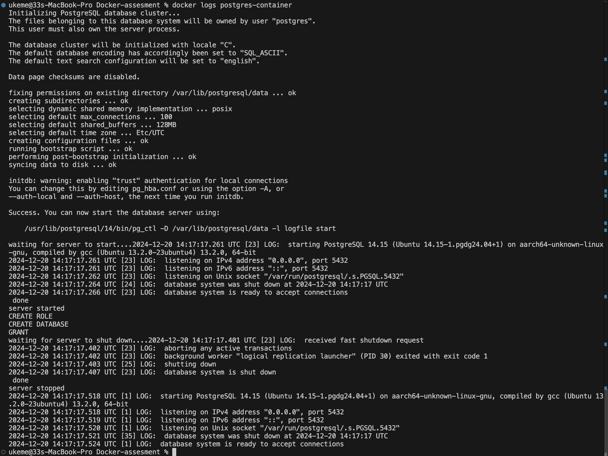

# Docker-assesment
Identify and fix these mistakes to make the Dockerfile functional.


## Issues in the Dockerfile.old

1.	PostgreSQL Version Handling:
    •	The latest tag for Ubuntu may not match the PostgreSQL version and directory paths you are referencing (/etc/postgresql/13/main).
2.	Service Command in RUN:
	•	The RUN command is executed at build time, not during container runtime. Starting services like PostgreSQL in a RUN command will not persist when the container runs.
3.	Password Vulnerability:
	•	The PostgreSQL user password (mypassword) is hardcoded in the Dockerfile, which is insecure.
4.	Configuration Changes:
	•	The configuration file paths might not exist as expected for PostgreSQL on your base image.
5.	CMD Instructions:
	•	Using service postgresql start and tail -f /dev/null as the CMD is not ideal because the container won’t properly terminate or signal service status.


## How to build and run the image

1. Build: `docker build -t my-postgres .`
2. Check Images `docker images`
2. Run the built image: 
```
docker run -d \
  -e POSTGRES_PASSWORD=mypassword \
  -p 5432:5432 \
  --name postgres-container \
  my-postgres
```

## Output of the working version
`docker exec postgres-container pg_isready`


- Connect to the database using the credentials and show version


## Steps to troubleshoot issues with the running container
1. check the current state of container
`docker ps`


2. check the logs: 
`docker logs postgres-container`



## Steps to prevent exposure of postgres db credentials.
postgres db credentials.
we used two main methods to protect the database credentials:

1. Environment Variables: Instead of hardcoding the credentials in the script, we used environment variables:

```
${POSTGRES_USER}
${POSTGRES_PASSWORD}
${POSTGRES_DB}
```

These values are passed at runtime using the docker run command with -e flags, so they're not stored in the image or code.

2. Initialization Flag:

```
if [ ! -f "/var/lib/postgresql/data/.initialized" ]; then
    # Create user and set password
    touch /var/lib/postgresql/data/.initialized
fi
```

This creates a flag file after initial setup, so the passwords aren't re-exposed in logs or history during subsequent container starts.
The most important security aspects are:

- No hardcoded credentials in the script
- Credentials passed at runtime only
- One-time initialization to avoid exposing credentials in logs
- Using PostgreSQL's built-in MD5 authentication (md5 in pg_hba.conf)